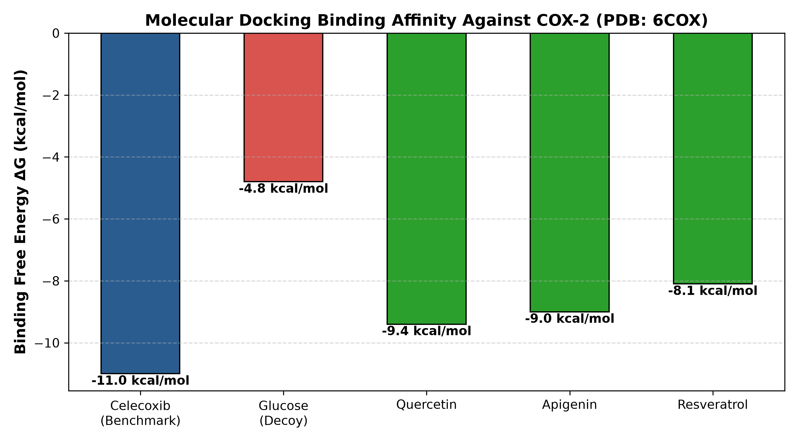
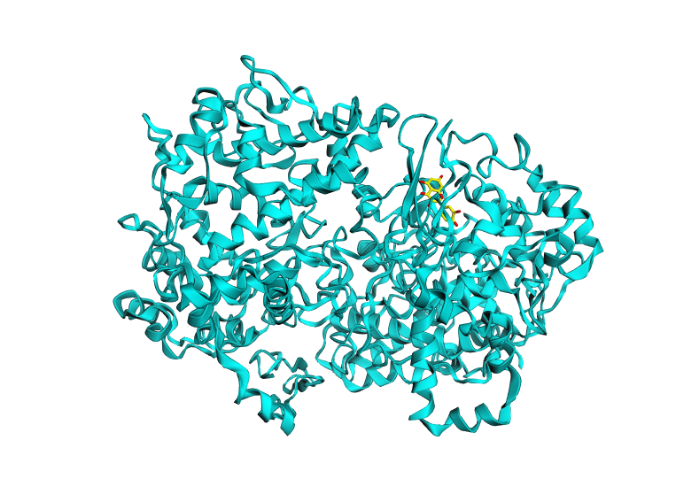

# COX2-Docking-Screening

A student bioinformatics project using Auto Dock Vina, Python, and 3D visualization to screen natural plant compounds against the human COX-2 protein.

---

## 🖐️ Project Overview

Hi! Welcome to my project.

This project started as a computational experiment to see whether everyday natural compounds—like the antioxidants found in apples, tea, or red wine—could bind to human inflammation proteins as effectively as standard prescription painkillers.

### What is COX-2?
Cyclooxygenase-2 (COX-2) is an enzyme in the human body responsible for producing prostaglandins, which trigger pain and inflammation. Popular nonsteroidal anti-inflammatory drugs (NSAIDs) like **Celecoxib** work by blocking this protein's active site.

---

## 🧪 Experimental Setup

Using **Auto Dock Vina** for molecular docking and **Python** for data processing, I tested five different molecules against human COX-2 (PDB structure `6COX`):

* **Celecoxib (Control / Standard NSAID):** Served as my positive control benchmark.
* **D-Glucose (Negative Control):** Used as a "decoy" sugar molecule to ensure the docking algorithm wouldn't just bind any random compound into the pocket.
* **Quercetin, Apigenin, & Resveratrol (Test Natural Compounds):** Natural flavonoids and polyphenols evaluated for their binding strength.

---

## 📊 Key Findings

* **Celecoxib** bound the tightest at **-11.0 kcal/mol**, which makes sense given it was specifically designed by pharmaceutical chemists to fit this pocket.
* **D-Glucose** bound weakly at **-4.8 kcal/mol**, confirming that the active site has strict shape and chemical selectivity.
* **Quercetin** was the top-performing natural compound, reaching **-9.4 kcal/mol**. It showed remarkable affinity for the active site, getting surprisingly close to the commercial drug standard.
* **Apigenin (-9.0 kcal/mol)** and **Resveratrol (-8.1 kcal/mol)** also showed strong binding affinities that were statistically significant compared to the sugar baseline.

---

## 📈 Visualizations & Active Site Interactions

### Comparative Binding Affinities

### 3D Binding Pocket (Quercetin in 6COX Active Site)

> 💡 *Note: An interactive 3D viewer is available by downloading and opening [`quercetin_3d_view.html`](quercetin_3d_view.html) in any web browser.*

https://nilakshdwivedi191.github.io/COX2--Docking--Screening/ - Click Here To Directly view 3D Model 
---

## 🛠️ Script Overview

1. **`data.py`**: Reads all raw binding scores, organizes them into a clean `pandas` table, and saves them to `docking_summary_results.csv`.
2. **`AnalyzeResults.py`**: Takes the summary spreadsheet and draws the comparative bar chart (`docking_results_chart.png`).
3. **`stats_analysis.py`**: Runs a $t$-test to mathematically double-check that the binding strength of natural flavonoids is significantly better than random noise or sugar.
4. **`3d_pocket.py`**: Uses `py3Dmol` to build the 3D model of Quercetin sitting inside the protein pocket and exports an interactive web viewer (`quercetin_3d_view.html`).
